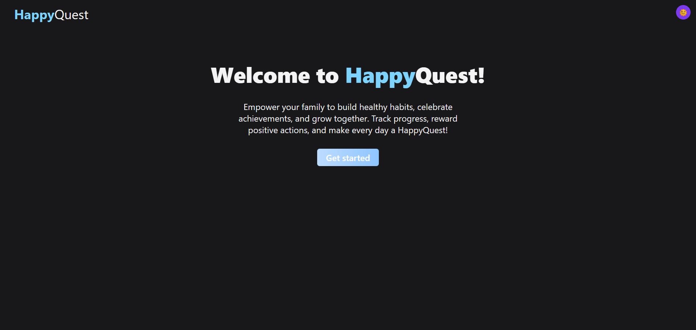

<a href="https://github.com/strahinjazoranovic/HappyQuest">
 
</a>


A task and reward application designed for parents and children to foster positive habits and engagement.

## Features

- **User Authentication:** Secure login for parents and children.
- **Task Management:** Parents can create, assign, and manage tasks for their children.
- **Reward System:** Parents can define rewards that children can redeem with earned points.
- **Point System:** Children earn points for completing tasks, which accumulate over time.
- **Parent Dashboard:** Overview of assigned tasks, approvals, and family management.
- **Child Dashboard:** View pending tasks, mark them as complete, and track earned points.
- **Leaderboard:** Displays children's progress and points, fostering healthy competition.
- **Role-Based Access:** Differentiates between parent and child functionalities.
- **Dark Mode Support:** User-friendly interface with a toggle for dark mode.

---

## Tech Stack

- **Frontend:** React, Next.js, TypeScript, Tailwind CSS, DaisyUI
- **Backend:** Node.js, TypeScript, PostgreSQL
- **API:** Next.js API Routes
- **Authentication:** JWT (JSON Web Tokens)
- **Database:** PostgreSQL

---

## Installation

To set up HappyQuest locally, follow these steps:

1.  **Clone the repository:**
    ```bash
    git clone https://github.com/strahinjazoranovic/HappyQuest.git
    cd HappyQuest
    ```

2.  **Install dependencies:**
    ```bash
    npm install
    # or
    yarn install
    ```

3.  **Set up environment variables:**
    Create a .env file in the root directory and copy the fields provided in .env.example and configure your PostgreSQL connection details

4.  **Database Setup:**
    Ensure you have a PostgreSQL database set up and the necessary tables are found in database/database.sql(currently empty, will be updated soon with the correct database structure).

5.  **Run the development server:**
    ```bash
    npm run dev
    # or
    yarn dev
    ```

6.  **Access the application:**
    Open your browser and navigate to `http://localhost:3000`.

---

## Usage

HappyQuest is designed for families to manage tasks and rewards collaboratively.

### For Parents

1.  **Login:** Use your parent credentials to log in.
2.  **Dashboard:** View active tasks assigned to children.
3.  **Assign Tasks:** Navigate to `Dashboard > Dashboard [Parent ID]` to assign new tasks to children. You can choose from existing tasks or create custom ones.
4.  **Manage Tasks:** Approve completed tasks, award points, or reject tasks with reasons.
5.  **Manage Rewards:** Go to `Dashboard > Reward Center [Parent ID]` to create, edit, or delete rewards.
6.  **Family Management:** Use `Dashboard > Family Management [Parent ID]` to allocate points to children.

### For Children

1.  **Login:** Use your child credentials to log in.
2.  **Child Dashboard:** Access your personal dashboard at `/child/[Child ID]`.
3.  **View Tasks:** See your assigned tasks, their point values, and any rejection reasons.
4.  **Complete Tasks:** Mark tasks as complete to earn points.
5.  **View Points:** Track your earned points and your position on the leaderboard.

---

## Project Structure

The project follows a standard Next.js structure:

```
HappyQuest/
├── public/
├── src/
│   ├── app/
│   │   ├── api/
│   │   │   ├── login/route.ts
│   │   │   ├── logout/route.ts
│   │   │   ├── reward/route.ts
│   │   │   ├── task/route.ts
│   │   │   ├── users/
│   │   │   │   ├── [userId]/assigned-tasks/
│   │   │   │   │   ├── [taskId]/actions/
│   │   │   │   │   │   ├── approve/route.ts
│   │   │   │   │   │   ├── complete/route.ts
│   │   │   │   │   │   ├── reject/route.ts
│   │   │   │   │   ├── route.ts
│   │   │   │   ├── child/[id]/dashboard/route.ts
│   │   │   │   ├── leaderbord/route.ts
│   │   │   │   ├── route.ts
│   │   │   │   ├── sidebar/route.ts
│   │   │   ├── route.ts
│   │   ├── child/[id]/page.tsx
│   │   ├── dashboard/
│   │   │   ├── family/[id]/page.tsx
│   │   │   ├── reward/[id]/page.tsx
│   │   │   ├── task/[id]/page.tsx
│   │   ├── ui/
│   │   │   ├── sidebar.tsx
│   │   │   ├── navbar.tsx
│   │   │   ├── globals.css
│   │   ├── login/page.tsx
│   │   ├── page.tsx
│   │   └── layout.tsx
│   ├── middleware.ts
├── .env.example
├── .eslintrc.json
├── next.config.ts
├── package.json
├── postcss.config.mjs
├── tsconfig.json
└── README.md
```

### Key Directories

* `src/app/api/` — API routes for creating and fetching guns, attachments, and loadouts.
* `src/app/child/[id]` — Child dashboard page.
* `src/app/dashboard/[id]` —  Parent dashboard page
* `src/app/login/` — Login page
* `src/app/ui/` — Shared UI components and global styles.
* `public/` — Static images and logos used throughout the application.

## Developer

Developed by [strahinjazoranovic](https://github.com/strahinjazoranovic).
